# API de Música

#### É uma API de música feita com Django que permite fazer upload de músicas, e tem um frontend feito com React JS para retornar os dados da API e tocar as músicas em um player de música. 

#### Músicas para colocar no projeto: [Um repositório do GitHub que criei só para deixar armazenadas as músicas](https://github.com/ /Musicas_API_Django_ReactJS). Essas músicas gringas antigas foram escolhidas por nostalgia, optei por colocar só 133 músicas.

## Funcionalidades do projeto

##### Backend(API)

- É possível adicionar, editar, excluir e atualizar informações das músicas enviadas.
- A demonstração será feita no Postman.

###### Adicionar Música - POST
- *name:* nome da música.
- *singer:* nome do artista.
- *cover:* é uma foto do artista ou do álbum, arquivo de imagem.
- *musicSrc:* é a música, o arquivo de áudio.
- *album:* nome do álbum.
- *year:* ano do lançamento da música ou álbum.

###### Depois do POST, será criado automaticamente uma pasta chamada ```media```, dentro do diretório ```backend``` e nela terá uma pasta chamada ```fotos``` e ```musicas```
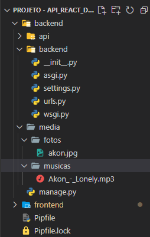
###### Retornar Música - GET
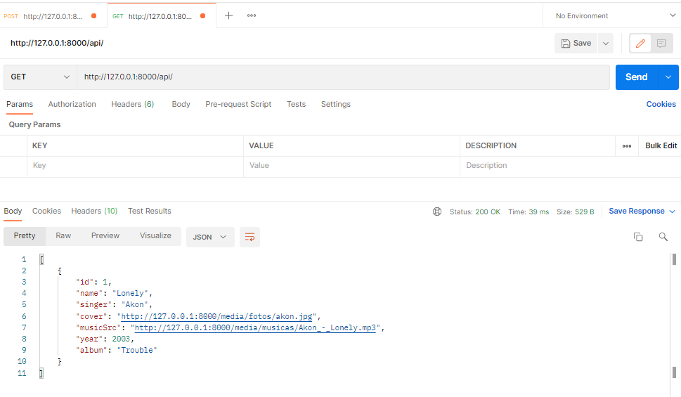
###### Atualizar Música - PATCH
*Foi mudado o arquivo de música e o nome da música, sendo que a música adicionada faz parte desse mesmo álbum.*
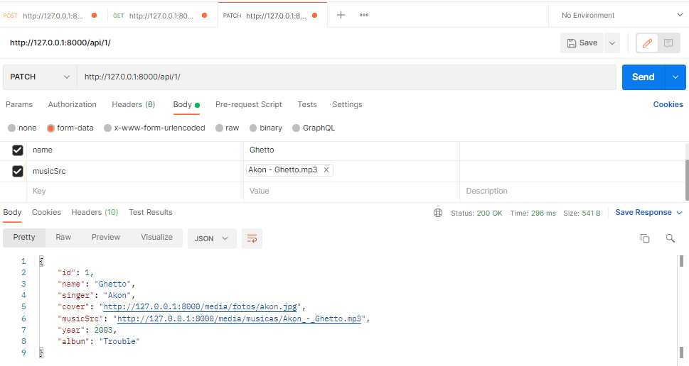
###### Excluir Música - DELETE
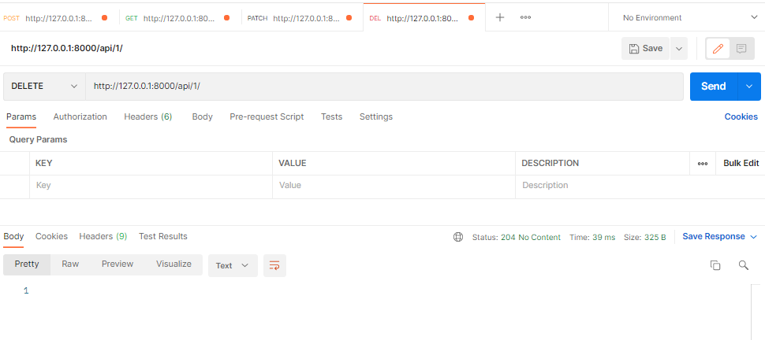
*Retornou dados nenhum, foi excluído com sucesso.*
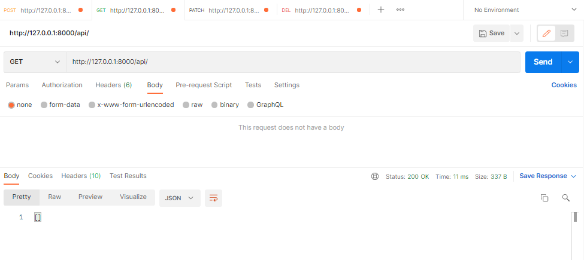
##### Frontend

*Obs: Essa lista de músicas não vem inclusa, será necessário adicionar elas na API usando o Postman.*
- Para abrir o player de música para ouvir as músicas da lista, clique em cima do círculo que possui um ícone de fone de ouvido.
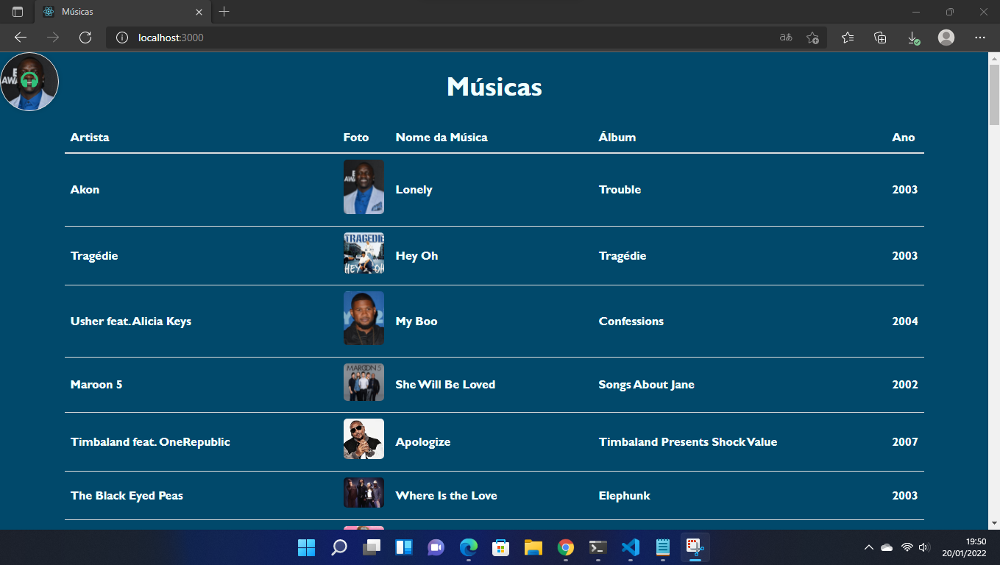
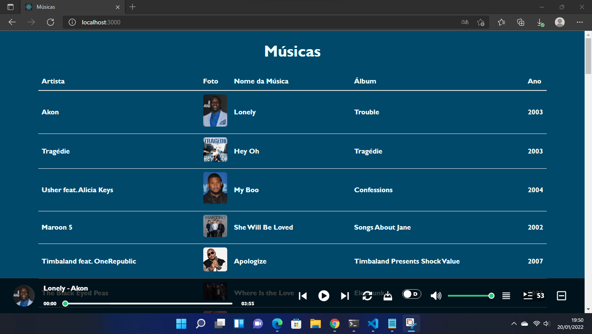
- Para minimizar o player de música, clique no ícone 

*Obs: Mesmo minimizando o player, a música continua tocando.*
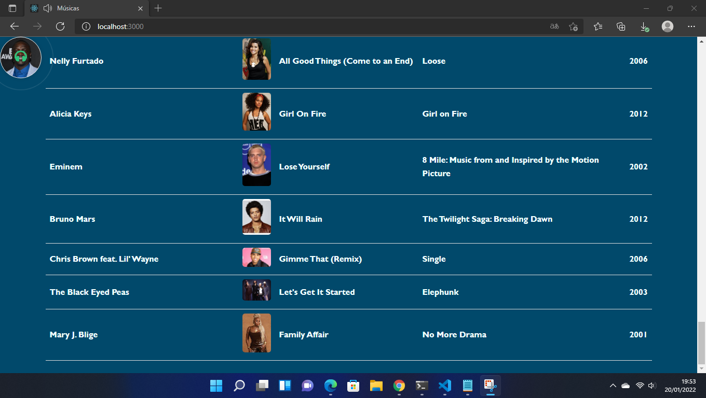
- O player de música tocando música.
- Se clicar nesse ícone 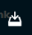 é possível fazer o download da música que você estiver ouvindo.
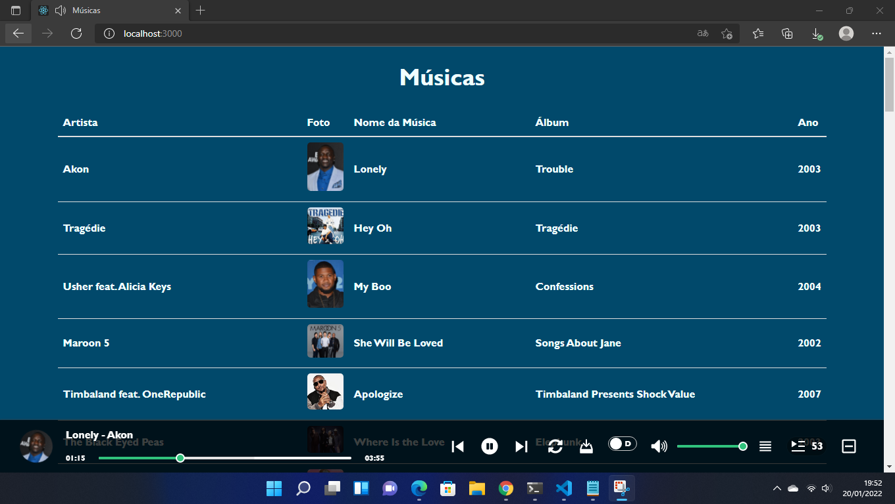
- Para abrir essa lista do próprio player, clique nesse ícone 
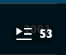
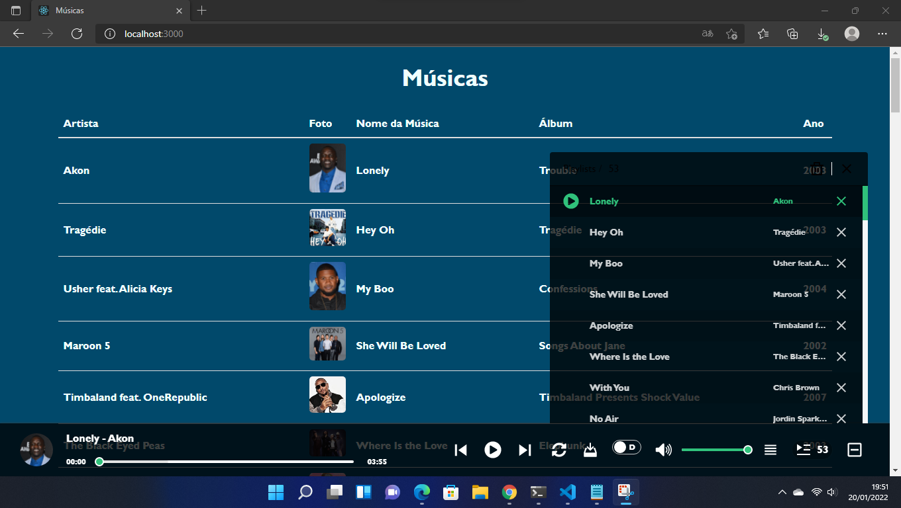

## 🛠 Tecnologias e Ferramentas usadas na construção do projeto:

- [Visual Studio Code](https://code.visualstudio.com/)

##### Backend
- [Python](https://www.python.org/)
- [Django](https://mariadb.org/)
- [MariaDB](https://mariadb.org/)
- [Postman](https://www.postman.com/)
- Dependências do Projeto em Django(Pipfile) 

```
[packages]
django = "4.0.1"
djangorestframework = "3.13.1"
pillow = "9.0.0"
django-cors-headers = "3.11.0"
mysqlclient = "2.1.0"

[dev-packages]

[requires]
python_version = "3.9"
```

##### Frontend
- [Node.js](https://nodejs.org/en/)
- [React](https://pt-br.reactjs.org/)
- Dependências do Projeto em ReactJS(package.json)  
```
"dependencies": {
    "@testing-library/jest-dom": "^5.16.1",
    "@testing-library/react": "^12.1.2",
    "@testing-library/user-event": "^13.5.0",
    "react": "^17.0.2",
    "react-dom": "^17.0.2",
    "react-jinke-music-player": "^4.24.2",
    "react-scripts": "5.0.0",
    "web-vitals": "^2.1.3"
  },
```
##### Para utilizar o player de música utilizado nesse projeto, siga a documentação oficial:
- [https://github.com/lijinke666/react-music-player](https://github.com/lijinke666/react-music-player)

## 🎲 Rodando o Back End (Servidor - API)

###### 1ª Clone este repositório
* git clone https://github.com/1997jorge/API_Django_ReactJS.git

###### 2ª Acesse a pasta do projeto no terminal/cmd
* cd API_Django_ReactJS

###### 3ª Instale o pipenv.
* pip3 install pipenv 
* Se der algum erro tente esse:
* pip install pipenv 

#### O pipenv é uma ferramenta completa para o gerenciamento de dependências em projetos Python, unindo Pipfile, pip e virtualenv em uma única ferramenta. Ele cria automaticamente o virtualenv e gerencia as suas dependências.

###### 4ª Ative o virtualenv do projeto com: 
* pipenv shell

###### 5ª Instale as dependências
* pipenv install

###### 6ª Vá para a pasta backend
* cd backend

###### 7ª Altere a senha e o usuário do banco de dados do arquivo settings.py
* Em ```'USER': ''``` dentro das aspas simples coloque o nome do usuário do seu banco, no caso do print está como root, usuário padrão que vem no banco de dados utilizado no projeto.
* Em ```'PASSWORD': ''``` dentro das aspas simples coloque o nome da senha do seu banco de dados, no caso do print foi colocado como root, por padrão o banco de dados vem sem senha.


* Se você não colocou senha no seu banco de dados, deixe então as aspas simples vazia ```'PASSWORD': ''``` ou apague esse codigo ```'PASSWORD': ''```

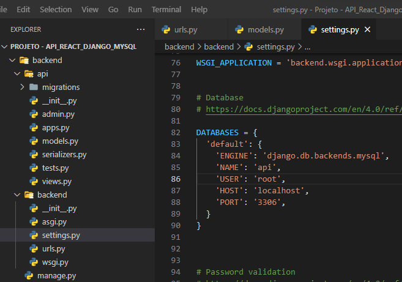

###### 8ª Crie um banco de dados chamado: api
* CREATE DATABASE api;


###### 9ª Rode as migrações.
* python manage.py migrate

###### 10ª Execute a aplicação 
* python manage.py runserver

###### 11ª O backend iniciará na porta: 8000 - Acesse: http://127.0.0.1:8000/api/

###### Na própria página da API, é possível adicionar músicas.

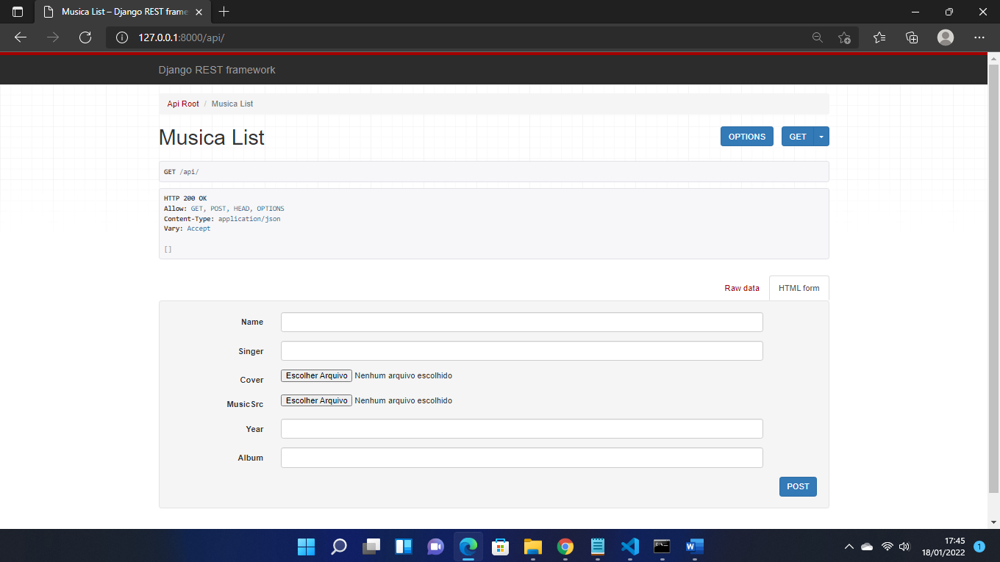

###### A escolha desses nomes foi para facilitar o envio das músicas para o player de música, porque segundo um exemplo [https://github.com/lijinke666/react-music-player/blob/master/example/example.js](https://github.com/lijinke666/react-music-player/blob/master/example/example.js) da documentação oficial, é necessário criar um array com os nomes abaixo para o player reconhecer o arquivo de musicas e imagem, o nome da música e artista.
###### Achei mais prático colocar esses nomes direto no banco de dados da aplicação.
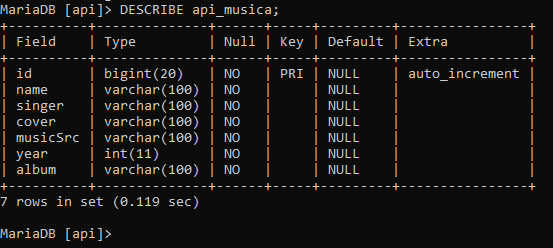
- name 
- singer
- musicSrc
- cover

1. name: é nome da música
2. singer: é o nome do artista
3. musicSrc: é a música, o arquivo de áudio...
4. cover: é uma foto do artista ou do álbum, arquivo de imagem...

## 🎲 Rodando o Front End 

###### 1ª Clone este repositório
* git clone <https://github.com/ /API_Django_ReactJS.git>

###### 2ª Acesse a pasta do projeto no terminal/cmd
* cd API_Django_ReactJS

###### 3ª Vá para a pasta frontend
* cd frontend

###### 4ª Instale as dependências
* npm install
* ou:
* yarn install

###### 5ª Execute a aplicação 
* npm start

###### O frontend iniciará na porta: 3000 - Acesse: http://localhost:3000/

* Acessando o link http://localhost:3000/ será aberto essa página.
* Para abrir o player de música, clique em cima do círculo que possui um ícone de fone de ouvido.
* Na tabela aparece sem músicas, isso vai acontecer quando o backend estiver offline ou se não tiver músicas na API.
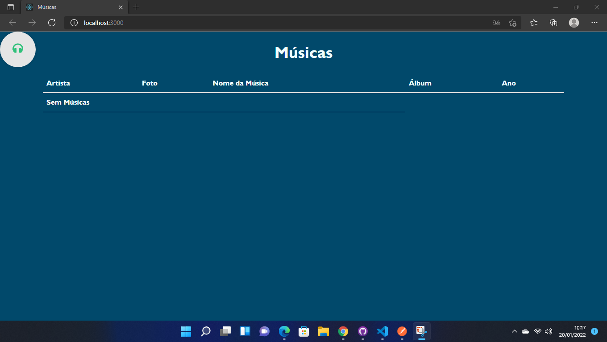
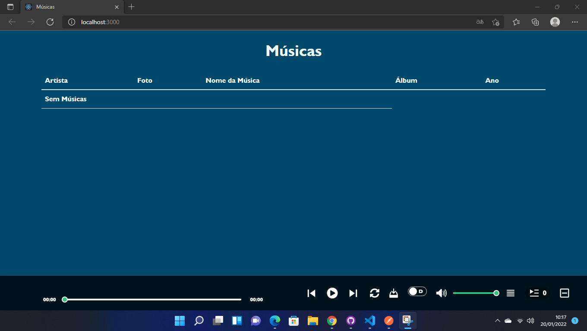

